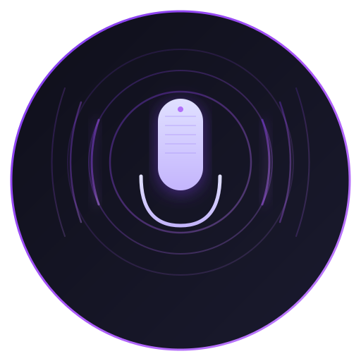

<div align="center">



# 🎙️ VCClient — Voice Changer

### *The upgraded Electron shell for w-okada's legendary real-time AI Voice Changer*

[](https://github.com/satiricalguru/Vcclient-voicechanger/releases)
[](https://github.com/satiricalguru/Vcclient-voicechanger/releases)
[](LICENSE)
[](https://www.electronjs.org/)
[](https://github.com/w-okada/voice-changer)

<br/>

**[⬇️ Download .exe](https://github.com/satiricalguru/Vcclient-voicechanger/releases/latest)** &nbsp;·&nbsp;
**[📖 How it Works](#how-it-works)** &nbsp;·&nbsp;
**[🎨 Features](#-features)** &nbsp;·&nbsp;
**[🚀 Quick Start](#-quick-start)**

<br/>

> Transform your voice in real-time with AI — now wrapped in a stunning glassmorphism desktop UI.
> Built on top of [w-okada/voice-changer](https://github.com/w-okada/voice-changer), the most powerful open-source voice conversion engine.

</div>

---

## ✨ Features

<table>
<tr>
<td width="50%">

### 🎨 Modern UI
- **Glassmorphism design** with 7 curated color themes
- **Violet** · **Indigo** · **Emerald** · **Rose** · **Cyber** · **Amber** · **Light**
- Animated particle background system
- Real-time VU meter visualization
- Floating status badge (ACTIVE / STANDBY)

</td>
<td width="50%">

### ⚡ Real-time AI Voice Conversion
- Sub-100ms latency voice changing
- **RVC v2** model support (ONNX optimized)
- **Beatrice v2** model support
- DirectML GPU acceleration (Windows)
- 5+ pre-loaded voice models included

</td>
</tr>
<tr>
<td width="50%">

### 🌐 Multi-Language
- 13 supported languages
- Arabic · German · Greek · English · Spanish
- French · Italian · Japanese · Korean · Malay
- Russian · Chinese · Latin
- Persistent language selection across sessions

</td>
<td width="50%">

### 🖥️ Desktop Integration
- Proper **Windows taskbar icon** (multi-resolution ICO)
- Seamless **Electron** desktop wrapper
- Auto-restarts backend if it crashes
- Clean process management (no zombie processes)
- Toast notification system

</td>
</tr>
</table>

---

## 🚀 Quick Start

### Option A — Download the Ready-to-Run Release (Recommended)

> **No installation required!** Just download and run.

1. Go to **[Releases →](https://github.com/satiricalguru/Vcclient-voicechanger/releases/latest)**
2. Download `VCClient-Setup-v2.0.78-beta.exe`
3. Run the installer
4. Launch **Voice Changer** from your desktop

### Option B — Run from Source

**Prerequisites:** Node.js 18+ · npm

```bash
# 1. Clone the repository
git clone https://github.com/satiricalguru/Vcclient-voicechanger.git
cd Vcclient-voicechanger

# 2. Install dependencies
npm install

# 3. Launch
npm run dev
```

> **Note:** `dist/main.exe` (the AI backend) must be present. It's included in the release download but excluded from git due to its size (424 MB). See [Releases](https://github.com/satiricalguru/Vcclient-voicechanger/releases) to download it separately.

---

## 🧠 How It Works

```
┌─────────────────────────────────────────────────────┐
│                  VCClient Stack                     │
│                                                     │
│  ┌─────────────────┐    ┌─────────────────────┐     │
│  │  Electron Shell │    │   React Web UI      │     │
│  │  (main.js)      │◄──►│   (index.js)        │     │
│  │                 │    │   + modern-ui.js    │     │
│  └────────┬────────┘    └─────────────────────┘     │
│           │                                         │
│           ▼  http://127.0.0.1:18000                 │
│  ┌─────────────────┐                                │
│  │  Python Backend │  ← main.exe                    │
│  │  (AI Engine)    │                                │
│  │  RVC v2 / Beat. │                                │
│  └─────────────────┘                                │
└─────────────────────────────────────────────────────┘
```

The **Python backend** (`dist/main.exe`) handles all AI voice conversion — it runs a local HTTP server on port `18000`. The **Electron shell** wraps the React web UI in a desktop window and manages the backend process lifecycle. The **modern UI overlay** (`modern-ui.js` + `modern-ui.css`) applies the glassmorphism theme and interactive controls on top of the original React interface.

---

## 🎨 UI Themes

| Theme | Preview Color | Best For |
|-------|--------------|----------|
| 🟣 Violet | `#8b5cf6` | Default — sleek dark purple |
| 🔵 Indigo | `#6366f1` | Cool blue-purple vibes |
| 🟢 Emerald | `#10b981` | Nature-inspired green |
| 🌸 Rose | `#ec4899` | Vibrant pink energy |
| ⚡ Cyber | `#ff007f` | Neon cyberpunk aesthetic |
| 🟡 Amber | `#f59e0b` | Warm golden tones |
| ☀️ Light | `#6366f1` | Clean light mode |

---

## 📁 Project Structure

```
Vcclient-voicechanger/
├── main.js              # Electron main process (window + icon)
├── start.js             # Backend process manager
├── package.json         # NPM config & scripts
├── app-icon.ico         # Multi-resolution Windows taskbar icon
├── scripts/
│   └── create_ico.py    # Regenerate ICO from PNG source
├── dist/
│   ├── main.exe         # [not in git] Python AI backend (~424 MB)
│   ├── modules/         # [not in git] ML inference models
│   ├── model_dir/       # [not in git] Voice model files
│   ├── settings/        # [not in git] Runtime config
│   ├── start_http.bat   # Launch backend (HTTP mode)
│   ├── start_https.bat  # Launch backend (HTTPS mode)
│   └── web_front/       # React UI + modern overlay
│       ├── index.html   # Entry point
│       ├── modern-ui.css # Glassmorphism theme styles
│       ├── modern-ui.js  # UI enhancements & interactivity
│       └── assets/
│           ├── icons/   # App icons (SVG, PNG, ICO)
│           └── i18n/    # 13-language translation files
└── .gitignore
```

---

## ⚙️ Configuration

Voice changer settings live in `dist/settings/vc_conf.json` (created at first run):

| Key | Default | Description |
|-----|---------|-------------|
| `current_slot_index` | `0` | Active voice model slot |
| `input_sample_rate` | `48000` | Microphone sample rate (Hz) |
| `output_sample_rate` | `48000` | Output sample rate (Hz) |
| `enable_performance_monitor` | `false` | Show FPS / latency overlay |

---

## 🛠️ Troubleshooting

<details>
<summary><b>🔴 Backend won't start</b></summary>

- Ensure `dist/main.exe` exists (download from [Releases](https://github.com/satiricalguru/Vcclient-voicechanger/releases))
- Check if port `18000` is already in use: `netstat -ano | findstr 18000`
- Run as Administrator if permission errors occur

</details>

<details>
<summary><b>🔴 UI not loading / blank screen</b></summary>

- The backend takes 5–15 seconds to initialize — wait a moment
- Check `vcclient.log` in the `dist/` folder for errors
- Restart the application

</details>

<details>
<summary><b>🔴 Audio issues / high latency</b></summary>

- Select the correct input/output audio device in Settings
- Try reducing the **chunk size** in the voice model settings
- Enable DirectML GPU acceleration if available
- Ensure your audio driver is up to date

</details>

<details>
<summary><b>🔴 Taskbar icon not showing</b></summary>

- This was a known bug (single-resolution ICO) — fixed in this release
- The `app-icon.ico` now contains 16×16, 32×32, 48×48, 64×64, 128×128, and 256×256 sizes
- Restart the app; Windows may cache the old icon

</details>

---

## 🙏 Original Project & Contributors

This project is an upgraded Electron shell built on top of the incredible work by **[@w-okada](https://github.com/w-okada)** and the contributors to **[w-okada/voice-changer](https://github.com/w-okada/voice-changer)** — the open-source real-time AI voice changer engine that powers everything under the hood.

> **⭐ Please star the original project:** [github.com/w-okada/voice-changer](https://github.com/w-okada/voice-changer)

### Core Contributors to w-okada/voice-changer

<table>
  <tr>
    <td align="center" valign="top" width="16.67%">
      <a href="https://github.com/w-okada">
        
        <br />
        <sub><b>w-okada</b></sub>
      </a>
    </td>
    <td align="center" valign="top" width="16.67%">
      <a href="https://github.com/Rafacasari">
        
        <br />
        <sub><b>Rafacasari</b></sub>
      </a>
    </td>
    <td align="center" valign="top" width="16.67%">
      <a href="https://github.com/hinabl">
        
        <br />
        <sub><b>hinabl</b></sub>
      </a>
    </td>
    <td align="center" valign="top" width="16.67%">
      <a href="https://github.com/nadare881">
        
        <br />
        <sub><b>nadare881</b></sub>
      </a>
    </td>
    <td align="center" valign="top" width="16.67%">
      <a href="https://github.com/icecoins">
        
        <br />
        <sub><b>icecoins</b></sub>
      </a>
    </td>
    <td align="center" valign="top" width="16.67%">
      <a href="https://github.com/InsanEagle">
        
        <br />
        <sub><b>InsanEagle</b></sub>
      </a>
    </td>
  </tr>
  <tr>
    <td align="center" valign="top" width="16.67%">
      <a href="https://github.com/QweRezOn">
        
        <br />
        <sub><b>QweRezOn</b></sub>
      </a>
    </td>
    <td align="center" valign="top" width="16.67%">
      <a href="https://github.com/frodo821">
        
        <br />
        <sub><b>frodo821</b></sub>
      </a>
    </td>
    <td align="center" valign="top" width="16.67%">
      <a href="https://github.com/Eidenz">
        
        <br />
        <sub><b>Eidenz</b></sub>
      </a>
    </td>
    <td align="center" valign="top" width="16.67%">
      <a href="https://github.com/deiteris">
        
        <br />
        <sub><b>deiteris</b></sub>
      </a>
    </td>
    <td align="center" valign="top" width="16.67%">
      <a href="https://github.com/qlife1146">
        
        <br />
        <sub><b>qlife1146</b></sub>
      </a>
    </td>
    <td align="center" valign="top" width="16.67%">
      <a href="https://github.com/Srgr0">
        
        <br />
        <sub><b>Srgr0</b></sub>
      </a>
    </td>
  </tr>
  <tr>
    <td align="center" valign="top" width="16.67%">
      <a href="https://github.com/TylorShine">
        
        <br />
        <sub><b>TylorShine</b></sub>
      </a>
    </td>
    <td align="center" valign="top" width="16.67%">
      <a href="https://github.com/tg-develop">
        
        <br />
        <sub><b>tg-develop</b></sub>
      </a>
    </td>
    <td align="center" valign="top" width="16.67%">
      <a href="https://github.com/eltociear">
        
        <br />
        <sub><b>eltociear</b></sub>
      </a>
    </td>
    <td align="center" valign="top" width="16.67%">
      <a href="https://github.com/JustSxm">
        
        <br />
        <sub><b>JustSxm</b></sub>
      </a>
    </td>
    <td align="center" valign="top" width="16.67%">
      <a href="https://github.com/markpaul099">
        
        <br />
        <sub><b>markpaul099</b></sub>
      </a>
    </td>
    <td align="center" valign="top" width="16.67%">
      <a href="https://github.com/richardhbtz">
        
        <br />
        <sub><b>richardhbtz</b></sub>
      </a>
    </td>
  </tr>
  <tr>
    <td align="center" valign="top" width="16.67%">
      <a href="https://github.com/bugyo">
        
        <br />
        <sub><b>bugyo</b></sub>
      </a>
    </td>
    <td align="center" valign="top" width="16.67%">
      <a href="https://github.com/moritzbrantner">
        
        <br />
        <sub><b>moritzbrantner</b></sub>
      </a>
    </td>
    <td align="center" valign="top" width="16.67%">
      <a href="https://github.com/dannadori">
        
        <br />
        <sub><b>dannadori</b></sub>
      </a>
    </td>
    <td align="center" valign="top" width="16.67%"></td>
    <td align="center" valign="top" width="16.67%"></td>
    <td align="center" valign="top" width="16.67%"></td>
  </tr>
</table>

> Full contributor list: [github.com/w-okada/voice-changer/graphs/contributors](https://github.com/w-okada/voice-changer/graphs/contributors)

---

## 📜 License

This project is licensed under the **MIT License**.

The underlying voice conversion engine (`dist/main.exe`) and bundled voice models are subject to their own respective licenses as documented in:
- `dist/web_front/licenses-js.json` — JavaScript dependencies
- `dist/web_front/licenses-py.json` — Python dependencies

---

## 💬 Support & Contributing

- **Issues:** [Open an issue](https://github.com/satiricalguru/Vcclient-voicechanger/issues)
- **Feature requests:** [Discussions](https://github.com/satiricalguru/Vcclient-voicechanger/discussions)
- **Original engine issues:** [w-okada/voice-changer](https://github.com/w-okada/voice-changer/issues)

---

<div align="center">

Made with ❤️ by **[satiricalguru](https://github.com/satiricalguru)**

*Powered by [w-okada/voice-changer](https://github.com/w-okada/voice-changer)*

</div>
